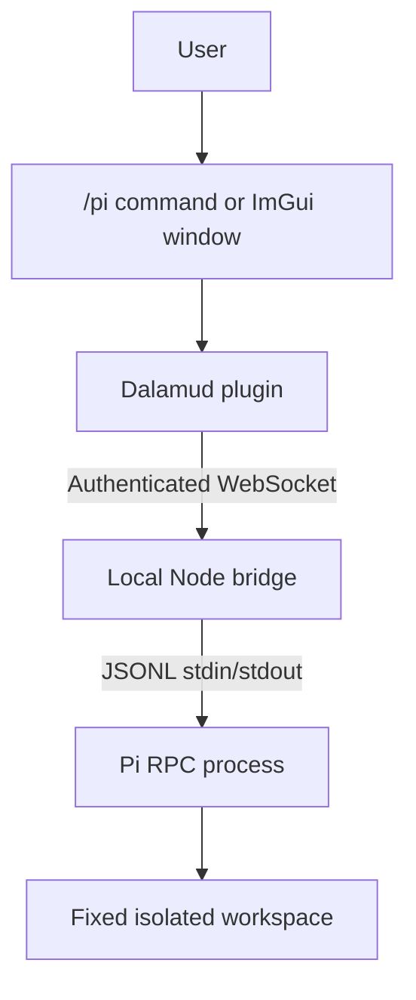

# Pi chat for FFXIV through Dalamud

Implementation handoff and technical specification

Status: Ready for implementation

Prepared: 2026-08-29
Audience: Codex coding agents and maintainers

## Start here

Build a private Dalamud plugin that provides a dedicated in-game chat UI for the Pi coding agent. Keep Pi in a separate local Node.js bridge. Connect the plugin to the bridge with an authenticated WebSocket bound to `127.0.0.1`.

Implement the MVP defined in this document. Do not add gameplay automation, ambient chat ingestion, streaming tokens, remote-network access, or arbitrary workspace selection.

The originating workspace also contains `dalamud-pi-chat-feasibility.md`, which records the research behind this specification. This document is authoritative when the two differ.

## Product goal

The user opens a dedicated Pi chat window inside FFXIV, sends a prompt, and receives Pi's completed response without leaving the game.

The plugin may print short local notices in the native FFXIV chat window. It must keep the full conversation in its dedicated ImGui window. It must not send Pi content to Square Enix chat servers.

## MVP user experience

The plugin supports these commands:

```text
/pi                    Open or focus the Pi chat window
/pi <prompt>           Send a prompt
/pi stop               Abort the active Pi turn
/pi status             Print the bridge and Pi status locally
/pi new                Start a new Pi session after confirmation
```

The dedicated window contains:

- A scrollable transcript with user and assistant messages.
- A multiline prompt editor.
- **Send**, **Stop**, and **New session** buttons.
- A connection indicator with `Disconnected`, `Connecting`, `Idle`, `Running`, and `Error` states.
- One compact status line for the current request.

The MVP returns only the completed assistant response. It does not stream token deltas. While Pi works, the window shows `Running` and the native chat may show `[Pi] Working...` once.

When Pi finishes, the plugin adds the final text to the transcript. It may print `[Pi] Response received. Use /pi to view.` locally through `IChatGui.Print()`.

## Scope

### In scope

- A Dalamud plugin written in C#.
- A dedicated ImGui transcript and prompt window.
- Local `/pi` commands.
- A Node.js and TypeScript bridge.
- An authenticated loopback WebSocket.
- One configured Pi workspace.
- One active Pi session.
- Pi subprocess control through strict JSONL RPC.
- Final, non-streamed assistant responses.
- Abort, status, new session, reconnect, and clean plugin unload.
- Unit tests for protocol parsing and bridge behavior.
- A fake Pi process for integration tests.

### Out of scope

- Party, tell, say, NPC, combat-log, or other ambient chat input.
- Gameplay commands, game-state triggers, memory manipulation, packet interaction, or automation.
- Sending Pi output to FFXIV servers.
- LAN or internet access to the bridge.
- Multiple users, tenants, workspaces, or concurrent Pi sessions.
- Raw Pi RPC access from the plugin.
- Raw RPC `bash` commands.
- Token streaming, tool-call visualization, or in-game approval dialogs.
- Public plugin repository submission or automatic updates.
- Named-pipe transport. It remains a future option.

## Architecture



### WSL mirrored-mode deployment

Use this deployment when Pi already runs in WSL with `networkingMode=mirrored`:

| Component                          | Location                        |
| ---------------------------------- | ------------------------------- |
| FFXIV and the Dalamud plugin       | Windows                         |
| Node.js bridge                     | The same WSL distribution as Pi |
| Pi RPC process and fixed workspace | WSL                             |

The bridge must bind to the IPv4 loopback address `127.0.0.1` on an unused port. Use port `32145` unless configuration selects another unused port. Configure the plugin with `ws://127.0.0.1:32145`. Do not use `localhost`, because name resolution can select IPv6. Do not bind the bridge to `0.0.0.0`, because mirrored networking can expose a WSL service to the LAN.

Mirrored networking lets Windows and WSL connect through `127.0.0.1`. This deployment does not require the WSL IP address, `netsh portproxy`, or `hostAddressLoopback=true`. Running the bridge beside Pi also keeps process launch, standard input, standard output, credentials, and the workspace inside WSL. Only the authenticated WebSocket crosses the Windows and WSL boundary.

After starting the bridge in WSL, test the port from Windows PowerShell:

```powershell
Test-NetConnection 127.0.0.1 -Port 32145
```

If the test fails, check the Windows and Hyper-V firewall rules for WSL. Add a narrow inbound TCP rule for the configured port instead of disabling the firewall or allowing all WSL inbound traffic. Run this command from an elevated Windows PowerShell session when port `32145` is configured:

```powershell
New-NetFirewallHyperVRule `
  -Name "PiDalamudBridge" `
  -DisplayName "Pi Dalamud Bridge" `
  -Direction Inbound `
  -VMCreatorId '{40E0AC32-46A5-438A-A0B2-2B479E8F2E90}' `
  -Protocol TCP `
  -LocalPorts 32145
```

Dalamud's optional AppContainer sandbox can also block loopback connections. If sandboxing is enabled, test the WebSocket connection from the plugin and configure the required loopback permission before changing the bridge bind address.

### Trust boundaries

The Dalamud plugin runs inside `ffxiv_dx11.exe`. Keep it small and responsive.

The bridge owns Pi credentials, process supervision, session state, RPC parsing, and workspace selection. A bridge failure must not freeze or crash FFXIV.

Pi runs with the bridge account's permissions. Start it with read-only tools for the MVP. Run it in a dedicated workspace and use an OS, container, or VM boundary before enabling edits or shell access.

## Technology stack

Versions in this table were current in the source manifests on 2026-08-29. Revalidate them before scaffolding.

| Component          | Technology                                                                           | Version or source                      |
| ------------------ | ------------------------------------------------------------------------------------ | -------------------------------------- |
| Plugin build       | `Dalamud.NET.Sdk`                                                                    | `15.0.0` in the official SamplePlugin  |
| Plugin language    | C# and the .NET runtime selected by the Dalamud SDK                                  | SDK-managed                            |
| Plugin UI          | `Dalamud.Interface.Windowing` and ImGui.NET                                          | Provided by Dalamud                    |
| Plugin services    | `IDalamudPluginInterface`, `ICommandManager`, `IChatGui`, `IFramework`, `IPluginLog` | Provided by Dalamud                    |
| Plugin networking  | `System.Net.WebSockets.ClientWebSocket`                                              | .NET built-in                          |
| Plugin JSON        | `System.Text.Json`                                                                   | .NET built-in                          |
| Plugin queue       | `ConcurrentQueue<T>`                                                                 | .NET built-in                          |
| Bridge runtime     | Node.js                                                                              | `>=22.19.0` required by Pi             |
| Bridge language    | TypeScript                                                                           | Current stable compatible with Node 22 |
| Pi                 | `@earendil-works/pi-coding-agent`                                                    | `0.84.4` in the current manifest       |
| WebSocket server   | `ws`                                                                                 | Pin the current stable version         |
| Message validation | `zod`                                                                                | Pin the current stable version         |
| Tests              | Vitest                                                                               | Pin the current stable version         |

Do not add React, Electron, WPF, Blazor, ASP.NET, Express, Fastify, or a model-provider SDK. The plugin uses ImGui. The bridge uses `ws`. Pi owns model-provider access.

## Repository layout

Use one repository:

```text
pi-dalamud/
├── README.md
├── docs/
│   └── protocol-v1.md
├── src/
│   ├── PiDalamud.Plugin/
│   │   ├── PiDalamud.Plugin.csproj
│   │   ├── Plugin.cs
│   │   ├── Configuration.cs
│   │   ├── Bridge/
│   │   │   ├── BridgeClient.cs
│   │   │   ├── BridgeMessage.cs
│   │   │   └── BridgeState.cs
│   │   └── Windows/
│   │       ├── PiChatWindow.cs
│   │       └── ConfigWindow.cs
│   └── bridge/
│       ├── package.json
│       ├── tsconfig.json
│       ├── src/
│       │   ├── index.ts
│       │   ├── config.ts
│       │   ├── protocol.ts
│       │   ├── ws-server.ts
│       │   └── pi-rpc-process.ts
│       └── test/
│           ├── protocol.test.ts
│           ├── rpc-parser.test.ts
│           └── bridge.integration.test.ts
└── test-fixtures/
    └── fake-pi-rpc.mjs
```

Keep protocol field names synchronized between `protocol.ts`, `BridgeMessage.cs`, and `docs/protocol-v1.md`. Treat the protocol document as the human-readable contract and the code types as the executable contract.

## Bridge protocol v1

Use one JSON object per WebSocket text message. Reject binary frames. Reject unknown message types. Set a maximum frame size of 64 KiB for the MVP.

Every message contains:

```json
{
  "version": 1,
  "type": "message_type"
}
```

### Authentication

The bridge binds to `127.0.0.1` only. It requires this header during the WebSocket upgrade:

```text
Authorization: Bearer <random-token>
```

Generate at least 32 random bytes with `node:crypto`. The bridge writes the token to its private configuration and prints pairing instructions. The user copies the token into the plugin configuration. Never include the token in logs or URLs.

Reject the upgrade when the header is missing or invalid. Compare tokens with a timing-safe comparison.

### Plugin-to-bridge messages

#### `prompt`

```json
{
  "version": 1,
  "type": "prompt",
  "requestId": "018f...",
  "text": "Explain the failing test"
}
```

Rules:

- `requestId` is a plugin-generated UUID.
- `text` must contain 1 to 16,000 Unicode characters after trimming.
- The bridge accepts one active request.
- A second prompt while Pi runs returns `busy`.

#### `abort`

```json
{
  "version": 1,
  "type": "abort",
  "requestId": "018f..."
}
```

The bridge aborts only the matching active request.

#### `get_status`

```json
{
  "version": 1,
  "type": "get_status"
}
```

#### `new_session`

```json
{
  "version": 1,
  "type": "new_session"
}
```

Reject this request while Pi runs. The plugin asks the user for confirmation before sending it.

### Bridge-to-plugin messages

#### `ready`

```json
{
  "version": 1,
  "type": "ready",
  "sessionId": "pi-session-id",
  "state": "idle"
}
```

#### `accepted`

```json
{
  "version": 1,
  "type": "accepted",
  "requestId": "018f..."
}
```

This means Pi accepted the prompt. It does not mean Pi finished.

#### `settled`

```json
{
  "version": 1,
  "type": "settled",
  "requestId": "018f...",
  "sessionId": "pi-session-id",
  "text": "The completed assistant response"
}
```

Send `settled` only after Pi emits `agent_settled`. Obtain the final text from the last assistant message or the RPC `get_last_assistant_text` command.

#### `status`

```json
{
  "version": 1,
  "type": "status",
  "state": "running",
  "sessionId": "pi-session-id",
  "activeRequestId": "018f..."
}
```

Valid states are `starting`, `idle`, `running`, and `error`.

#### `aborted`

```json
{
  "version": 1,
  "type": "aborted",
  "requestId": "018f..."
}
```

#### `error`

```json
{
  "version": 1,
  "type": "error",
  "code": "bridge_unavailable",
  "message": "Pi process exited",
  "requestId": "018f..."
}
```

Use stable codes. Do not send stack traces, provider credentials, filesystem paths, or raw Pi events to the plugin.

Required MVP codes:

- `unauthorized`
- `invalid_message`
- `message_too_large`
- `busy`
- `request_not_active`
- `pi_start_failed`
- `pi_exited`
- `pi_prompt_failed`
- `pi_abort_failed`
- `session_switch_failed`
- `internal_error`

## Pi RPC worker

Start one child process in the bridge-configured workspace:

```text
pi --mode rpc \
  --no-approve \
  --no-extensions \
  --no-skills \
  --no-context-files \
  --tools read,grep,find,ls \
  --session-dir <bridge-owned-session-directory>
```

The bridge chooses the working directory. The plugin never supplies a path.

Use `node:child_process.spawn()` with separate stdin, stdout, and stderr pipes. Do not use a shell.

Parse stdout with a byte buffer. Split records on LF only. Strip a trailing CR. Do not use Node's `readline`, because Pi's JSON strings may contain Unicode line separators that `readline` treats as record boundaries.

The bridge maps only these plugin operations to Pi RPC:

| Plugin operation | Pi RPC command                                  |
| ---------------- | ----------------------------------------------- |
| `prompt`         | `prompt`                                        |
| `abort`          | `abort`                                         |
| `get_status`     | `get_state`                                     |
| `new_session`    | `new_session`                                   |
| final response   | `get_last_assistant_text` after `agent_settled` |

Do not expose Pi's RPC `bash` command. Do not accept arbitrary Pi RPC objects from the plugin.

If Pi exits, fail the active request, move the bridge to `error`, and allow one explicit or supervised restart. Do not restart in a tight loop.

## Dalamud plugin design

### Services

Inject these services with `[PluginService]`:

- `IDalamudPluginInterface`
- `ICommandManager`
- `IChatGui`
- `IFramework`
- `IPluginLog`

Use `WindowSystem` for the chat and configuration windows. Follow the lifecycle in the official `goatcorp/SamplePlugin`.

### Command handling

Register `/pi` with `ICommandManager.AddHandler()`.

The handler performs only parsing and queueing. It returns without waiting for the bridge or Pi.

Parse commands in this order:

1. Empty input opens the window.
2. `stop` aborts the active request.
3. `status` requests bridge status.
4. `new` opens a confirmation dialog.
5. Any other non-empty input becomes a prompt.

Remove the handler in `Dispose()`.

### Network and thread model

`BridgeClient` owns `ClientWebSocket`, a receive task, a send lock, and a `CancellationTokenSource`.

The receive task runs off the framework thread. It validates each message and pushes an immutable event into `ConcurrentQueue<BridgeEvent>`.

Drain a bounded number of events during the framework update or UI draw callback. Apply transcript and connection-state changes only on that thread.

Do not call `.Wait()` or `.Result`. Do not perform network I/O in `Draw`, the command handler, or an `IFramework` callback.

On disposal:

1. Cancel the plugin token.
2. Close the WebSocket without blocking the framework thread.
3. Unsubscribe UI and framework handlers.
4. Remove `/pi`.
5. Remove and dispose windows.

Plugin unload disconnects the UI. It does not stop the bridge or delete the Pi session.

### Transcript model

Keep transcript entries in plugin memory for the MVP:

```text
TranscriptEntry
  Id
  Role: User | Assistant | System | Error
  Text
  TimestampUtc
  RequestId
```

Append the user message when the bridge sends `accepted`. Append the assistant message when the bridge sends `settled`.

Do not persist prompts or responses to the Dalamud plugin configuration in the MVP.

## Security requirements

These requirements are acceptance criteria, not suggestions:

- Bind the bridge only to `127.0.0.1`.
- Authenticate every WebSocket upgrade.
- Keep the bearer token out of URLs and logs.
- Reject binary, oversized, malformed, unknown, and unauthenticated messages.
- Keep the Pi workspace in bridge configuration.
- Start Pi with the exact read-only flags in this specification.
- Keep provider credentials in the bridge or Pi configuration, not the plugin.
- Expose no raw Pi RPC passthrough.
- Expose no bridge operation that executes a shell command.
- Read no ambient game chat.
- Send no Pi output to game chat servers.
- Trigger no gameplay actions.
- Log bridge lifecycle and stable error codes without prompt text by default.

Square Enix prohibits third-party tools. This private, local, manually invoked design does not make Dalamud use compliant. It limits the feature to chat UI and keeps it separate from gameplay automation.

## Reliability requirements

- A missing bridge keeps the plugin responsive and shows `Disconnected`.
- A lost WebSocket fails the active UI request and keeps the transcript intact.
- The plugin reconnects with capped exponential backoff from 1 to 30 seconds.
- Reconnecting requests `get_status` before enabling **Send**.
- A Pi process exit produces a stable error and never crashes the bridge.
- Malformed Pi stdout produces a logged protocol error and fails the active request.
- Pi stderr is logged separately and never parsed as JSONL.
- Plugin disposal completes without a synchronous wait on the game thread.

## Implementation sequence

### 1. Scaffold the repository

Create the repository layout, bridge package, Dalamud project, protocol document, and test projects. Pin versions and add build, test, format, and lint scripts.

Completion criterion: the empty bridge tests run, and the SamplePlugin-derived C# project builds with no warnings introduced by project code.

### 2. Build and test the Pi RPC wrapper

Implement `PiRpcProcess`, strict LF JSONL framing, request correlation, lifecycle events, abort, session creation, and final-text retrieval. Use `fake-pi-rpc.mjs` for deterministic tests.

Completion criterion: automated tests cover fragmented records, several records per chunk, CRLF input, Unicode separators inside JSON strings, child exit, stderr separation, prompt acceptance, `agent_settled`, final text, abort, and malformed JSON.

### 3. Build and test the WebSocket bridge

Implement authentication, Zod message validation, size limits, the single-request rule, state reporting, Pi mapping, and sanitized errors.

Completion criterion: integration tests prove that an authenticated client completes a prompt, an invalid token fails, a second prompt returns `busy`, abort works, unknown messages fail, and no protocol path reaches RPC `bash`.

### 4. Build the Dalamud connection layer

Implement `BridgeClient`, message DTOs, cancellation, reconnect, the concurrent event queue, and connection state.

Completion criterion: tests or a local harness prove connect, authenticated failure, accepted, settled, error, abort, reconnect, and disposal without synchronous blocking.

### 5. Build the plugin UI and commands

Implement `Plugin`, `/pi`, `PiChatWindow`, `ConfigWindow`, transcript state, local notifications, and new-session confirmation.

Completion criterion: `/pi` opens the window, a prompt reaches the bridge, the final response appears in the transcript, **Stop** aborts an active turn, and plugin unload removes every registered handler.

### 6. Prove failure isolation

Run the plugin with the bridge stopped, kill the bridge during a request, kill Pi during a request, return malformed bridge JSON, and reload the plugin during a request.

Completion criterion: FFXIV remains responsive in every case, the plugin reaches a clear recoverable state, and no orphaned plugin callbacks remain after unload.

### 7. Document local setup

Write setup instructions for the bridge token, fixed workspace, Pi authentication, WSL mirrored-mode deployment, bridge startup, Windows-side port testing, firewall troubleshooting, Dalamud dev-plugin loading, and basic troubleshooting.

Completion criterion: a developer can follow the README from a clean checkout and complete one `/pi` prompt without undocumented steps.

## Test plan

### Automated bridge tests

- Protocol schema validation.
- Authorization rejection.
- Request-size enforcement.
- Strict Pi JSONL framing.
- Single active request.
- Prompt-to-settled flow.
- Abort flow.
- New-session rejection while busy.
- Child exit and malformed output.
- Sanitized error payloads.

### Plugin tests or harness tests

- Command parser.
- Bridge message deserialization.
- Transcript reducer.
- Connection state transitions.
- Reconnect backoff.
- Disposal cancellation.

### Manual Dalamud checks

- `/pi` opens and focuses the window.
- `/pi hello` produces one final assistant message.
- Native chat receives only local notices.
- Long responses remain readable in the ImGui window.
- **Stop** aborts an active request.
- **New session** asks for confirmation.
- Bridge loss does not stall a frame.
- Plugin reload leaves no duplicate command or draw handler.
- Normal party and tell chat never reaches the bridge.
- With the bridge and Pi in mirrored-mode WSL, the Windows plugin connects through `ws://127.0.0.1:32145`.

## MVP acceptance criteria

The MVP is complete when all statements below are true:

1. A user can open the dedicated window with `/pi`.
2. A user can send a prompt from the window or `/pi <prompt>`.
3. The plugin receives and displays Pi's completed response.
4. The plugin does not require streamed token support.
5. The bridge listens only on authenticated loopback WebSocket connections.
6. The plugin never supplies a workspace path or raw Pi command.
7. Pi starts with read-only tools and cannot receive an RPC `bash` request through the bridge.
8. Ambient FFXIV chat never becomes Pi input.
9. Pi output remains local to the plugin UI and local chat notices.
10. Bridge and Pi failures do not freeze or crash FFXIV.
11. Plugin unload removes all Dalamud handlers and cancels its network work.
12. Automated tests cover the bridge protocol, RPC framing, and failure paths.
13. The README reproduces a successful local prompt from a clean checkout.

## Deferred decisions

These decisions do not block the MVP:

- Replace WebSocket with a Windows named pipe.
- Embed `AgentSession` in the bridge instead of spawning RPC.
- Stream assistant text into the ImGui transcript.
- Display tool activity.
- Map Pi extension confirmations to ImGui dialogs.
- Persist transcripts.
- Support several named Pi sessions or workspaces.
- Package the bridge as a tray application or Windows service.

Record a short ADR before changing the MVP transport, Pi integration mode, trust boundary, or workspace model.

## Source references

- [Dalamud repository](https://github.com/goatcorp/Dalamud)
- [Official Dalamud SamplePlugin](https://github.com/goatcorp/SamplePlugin)
- [`ICommandManager`](https://github.com/goatcorp/Dalamud/blob/master/Dalamud/Plugin/Services/ICommandManager.cs)
- [`IChatGui`](https://github.com/goatcorp/Dalamud/blob/master/Dalamud/Plugin/Services/IChatGui.cs)
- [`IFramework`](https://github.com/goatcorp/Dalamud/blob/master/Dalamud/Plugin/Services/IFramework.cs)
- [Dalamud sandboxing](https://github.com/goatcorp/Dalamud/wiki/Sandboxing)
- [Microsoft WSL networking](https://learn.microsoft.com/en-us/windows/wsl/networking)
- [Microsoft WSL configuration](https://learn.microsoft.com/en-us/windows/wsl/wsl-config)
- [Microsoft Hyper-V firewall configuration](https://learn.microsoft.com/en-us/windows/security/operating-system-security/network-security/windows-firewall/hyper-v-firewall)
- [Pi RPC protocol](https://github.com/earendil-works/pi/blob/main/packages/coding-agent/docs/rpc.md)
- [Pi SDK](https://github.com/earendil-works/pi/blob/main/packages/coding-agent/docs/sdk.md)
- [Pi security](https://github.com/earendil-works/pi/blob/main/packages/coding-agent/docs/security.md)
- [Pi containerization](https://github.com/earendil-works/pi/blob/main/packages/coding-agent/docs/containerization.md)
- [Square Enix statement on third-party tools](https://na.finalfantasyxiv.com/lodestone/topics/detail/36c4d699763603fadd2e61482b0c5d56cb2e4547)

## Suggested skills for the next agent

The next Codex coding agent should call these skills when available:

- `implement` to execute this specification in bounded stages.
- `typescript-best-practices` before reading or editing `.ts` files.
- `tdd` for the bridge protocol, RPC parser, and fake-Pi integration path.
- `principle-prove-it-works` before declaring the feature complete.
- `diagnosing-bugs` if the bridge, plugin reload, or framework-thread path fails.
- `technical-writing` when updating the README, protocol document, or ADRs.
